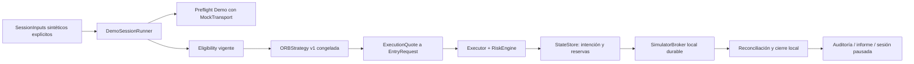

# A6 — sesión Demo simulada, ejecución externa bloqueada

**Estado: PASS, 2026-09-16.** 758 pruebas y 16/16 gates aprobados; 39 casos A6.
Dos runs aceptados y retry con igualdad funcional; caso sin señal sin intenciones.
Evidencia local runtime/a6/comparison.json y verification.json.

Implementación local independiente de A7. El runner conecta Strategy 1 congelada
con elegibilidad, riesgo, intenciones durables, simulador y reconciliación. El
resultado es evidencia del software interno; no es una sesión de mercado real,
una nueva verificación A5 ni una prueba de rentabilidad. Checks exactos de entrega
en [VERIFICATION](VERIFICATION.md).

## Mapa revisado antes de implementar

| Responsabilidad | Componente existente reutilizado |
|---|---|
| Orquestación anterior | OperationService solo soportaba el recorrido fixture v0.1; el modo conectado seguía bloqueado |
| Datos y calendario | DataBundle, FixtureProvider, session/flatten_at; sin descargar ni reclasificar datos reales |
| Strategy 1/señales | ORBStrategy y configs/strategy-1-v1.yaml, ORB_RVOL_v1.0 congelada con RS contra SPY/QQQ |
| Identidad Demo | perform_preflight y GuardedTransport, exclusivamente con MockTransport para el contexto A6 |
| Elegibilidad/precios | Instrument, InstrumentRules y EntryRequest; RiskEngine conserva sus validaciones financieras |
| Riesgo/costes/protección | RiskEngine, RiskConfig y CostConfig aprobados; sin modificar parámetros |
| Intención y frontera de ejecución | Executor.submit_entry, UUIDv5, APPROVED → SUBMITTING antes de broker.submit |
| Persistencia/propiedad/reservas | StateStore, SQLite v1, transacciones y restricciones únicas existentes |
| Ejecución local | SimulatorBroker con aceptación durable en simulator_orders |
| Reconciliación y recuperación | Executor.__enter__/reconcile/close_owned, estados UNKNOWN/EXPIRED y fills acumulados |
| Exclusión de escritores | ExecutorLock del proyecto, conservado dentro de Executor |

Se revisaron tests de estrategia v1, ejecución, persistencia/recovery, riesgo,
transportes y preflight antes de construir el runner. No se cambiaron estos
componentes ni sus contratos. El nuevo código se limita a tres módulos de ejecución,
un script explícito de demostración y sus pruebas.

## Flujo y responsabilidades



`execution/session.py` orquesta. `session_inputs.py` contiene evidencia explícita
de contexto, elegibilidad y cotización, su vigencia y el mapeo a EntryRequest.
La estrategia sigue decidiendo la señal; el runner no la fabrica ni modifica.
El riesgo, sizing, stops, costes, reservas, libro y ciclo de órdenes permanecen en
los componentes existentes. No hay migración de base de datos.

El contexto Demo se comprueba reutilizando el preflight con respuestas fabricadas
por un MockTransport interno. Son obligatorios source=SIMULATED y vigencia del
contexto; account/scopes/cash inválidos fallan con los guards A5. El presupuesto
configurado no puede superar el crédito virtual simulado. No se consume el JSON
A5 histórico como autorización vigente, no se cargan credenciales y no se llama a
DemoAuthorization.activate. A5 real sigue cerrado por su propia evidencia.

Elegibilidad requiere identidad Instrument exacta, stable_id y ventana explícita.
Se comprueba al iniciar y al intentar entrada; SPY/QQQ permanecen referencias.
Sus reglas financieras se pasan sin cambios al motor de riesgo. Cotizaciones
ejecutables y de cierre son entradas obligatorias, nunca un fallback implícito.
El motor conserva caducidad, frescura, spread, divergencia, costes, stop, producto,
límites de cantidad/nominal, cupos y pérdida diaria. Ningún rechazo llega a submit.

Al terminar, el runner pausa entradas, cancela remanentes locales y solicita
cierres propios con bid explícito dentro de la ventana flatten_at → close del
calendario existente. Reconciliación y ausencia de exposición activa son requisitos
de PASS. Un cierre sin cotización válida o parcial conserva exposición y BLOCKED;
no inventa FLAT. PASS también puede representar un ciclo correcto sin señal o con
señal rechazada: no significa que riesgo haya aprobado una entrada.

## Frontera sin red

DemoSessionRunner construye SimulatorBroker directamente y verifica su clase
exacta y su StateStore antes de ejecutar. No admite factory, adaptador externo,
transport de ejecución o flag de habilitación. Configuración y base deben ser
offline, order_submission_enabled=false, Strategy 1 v1 congelada y datos
explícitamente sintéticos. Otro modo, procedencia o broker falla cerrado.
Los defaults de InstrumentRules solo aparecen en la fixture sintética, nunca se
declaran evidencia de elegibilidad externa.

La única simulación HTTP es el preflight con MockTransport: no hay sockets ni
órdenes HTTP. El simulador realiza submits/cancelaciones/cierres exclusivamente en
SQLite. Las pruebas A6 bloquean todo socket y exigen MockTransport para construir
un cliente HTTP; registran cualquier intento y fallan al terminar incluso si
Executor capturó la excepción. Los spies comprueban cero submit en rechazos y que
la intención y reserva ya existen cuando un submit aceptado cruza la frontera.
Las guardas externas A5/eToro permanecen intactas. No se ejecutó ninguna lectura
de cuenta externa ni se cargó .env durante A6.

## Persistencia, idempotencia y recuperación

Cada ejecución usa una base dedicada, marcada con a6_binding. La huella incorpora
configuración, fecha, barras reales del bundle (no solo el hash declarado),
instrumentos, manifest y entradas de contexto/precios/elegibilidad. Solo se
persiste la huella de esas entradas; no se guarda el payload de identidad/portfolio.
Un cambio de entradas con la misma base queda BLOCKED. Para otro escenario se
elige una nueva base: nunca se elimina o reescribe trabajo anterior.

El runner utiliza ExecutorLock también alrededor de la vinculación de contexto;
Executor conserva su propio bloqueo existente para todas las órdenes. No hay
leases ni nueva política de idempotencia de bróker. UUIDv5 y unicidad SQLite
estrategia/versión/sesión/símbolo protegen entradas; la salida conserva su ID por
posición. A6 no altera las transiciones ni vuelve a enviar un UNKNOWN.

| Punto de fallo/reintento | Comportamiento |
|---|---|
| Repetir ciclo completado | Reconciliar, comprobar exposición y devolver resultado persistido, cero submits/cierres nuevos |
| Después de intención APPROVED, antes de envío | Caducar según Executor; BLOCKED, sin recrearla |
| Después de SUBMITTING, sin aceptación durable | UNKNOWN, reservas conservadas, BLOCKED, sin reenvío |
| Después de aceptación durable y antes de aplicar respuesta | Consultar simulator_orders, aplicar fill y continuar cierre; ninguna segunda entrada |
| Timeout tras aceptar | Reconciliar la aceptación guardada, no repetir efecto lógico |
| Fill/cierre parcial | Cancelar remanente local cuando procede; preservar exposición y BLOCKED mientras no esté flat |
| Reconciliación repetida | Mismos fills, posiciones, intenciones y PnL; sin doble contabilización |
| Resultado completado con exposición posterior | No reutilizar PASS si vuelve a existir exposición activa |

Persistencia: decisión Strategy completa en metadata; eventos A6 con session_id,
huellas, resultado/vigencia/reglas de elegibilidad, señal, decisión de riesgo,
intent_id, estado simulado, reconciliación y finalización/error. INTENT_DURABLE,
transiciones y fills siguen usando la auditoría existente. La decisión aprobada
queda representada en riesgo/costes de la intención antes de enviar; el evento de
resultado de riesgo del runner añade la correlación tras submit_entry.
Errores inesperados se reducen a A6_INTERNAL_ERROR, sin interpolar payloads.

## Ejecución reproducible

No cargar `.env`. Desde la raíz, con Python/uv/lock del proyecto:

```powershell
.\scripts\uv.ps1 run --frozen python scripts/run_a6.py --database runtime/a6/accepted-1.sqlite --report runtime/a6/accepted-1.json
.\scripts\uv.ps1 run --frozen python scripts/run_a6.py --database runtime/a6/accepted-2.sqlite --report runtime/a6/accepted-2.json
.\scripts\uv.ps1 run --frozen python scripts/run_a6.py --scenario no-signal --database runtime/a6/no-signal.sqlite --report runtime/a6/no-signal.json
```

El script usa la configuración v1 por defecto, admite --config explícito y exige
rutas de base e informe. Los informes se crean de forma exclusiva: elegir un nombre
nuevo para repetir. Reutilizar la misma base con las mismas entradas permite
comprobar recuperación, sin duplicar órdenes. SQLite/JSON permanecen en runtime
ignorado. La fixture extiende SIMA del FixtureProvider con benchmarks sintéticos
planos SPY/QQQ; mantiene barras y parámetros de estrategia. El tercer día del
fixture es el caso sin señal por RVOL insuficiente. No se atribuye valor de mercado
o rentabilidad a esos datos ni al PnL simulado.

Determinismo se refiere a decisiones, IDs, órdenes, cantidades, precios, costes y
resultado funcional. Los timestamps de auditoría/observación operativa usan el
reloj de ejecución existente y se excluyen de comparación funcional, no de trazas.

## Casos de aceptación y límites

Los siete casos mínimos están en tests/test_demo_session.py: no señal,
elegibilidad rechazada, riesgo rechazado con spy cero submit, aceptada con intención
previa al efecto local, precondición crítica ausente, restart en tres fronteras y
reconciliación repetida. Se añaden presupuestos inválidos, precios/cierres inválidos,
parciales, timeout, contexto vencido, inputs cambiados, inyección de broker externo,
procedencia incorrecta, errores sanitizados y determinismo entre bases nuevas.

A7 permanece pendiente. A6 no valida órdenes eToro, costes ni elegibilidad reales,
stops reales, semántica contable de cierres externos, feeds operativos o rentabilidad.
Los bloqueos documentados de datos operativos y reconciliación externa permanecen.
No se implementa un scheduler realtime ni un modo conectado nuevo. El estado offline
A6 no se debe promover a una sesión de cuenta; una autorización futura requiere
sus propios contratos, datos, riesgos y permiso temporal. Sin refactor general,
cambios de Strategy 1, schema, dependencias, credenciales o publicación.
