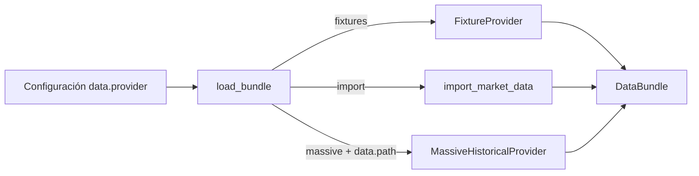
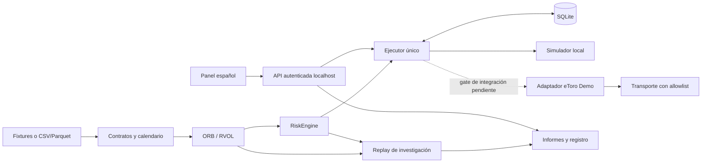

## A7 WebSocket: spike bloqueado por handshake HTTP 403

Revision contractual permite eToro WebSocket conservando el gate de 3 s.
Diagnostico aislado: el handshake devuelve HTTP 403 con pagina Proxy WebGateway
EPM, antes de Authenticate; cero eventos, suscripciones u ordenes. No se ha
integrado el stream al runner ni se ha cambiado codigo productivo, riesgo,
Strategy 1, A6, Massive, contratos congelados o uv.lock. Reconnect productivo
y validacion en mercado abierto pendientes; no declarar migracion PASS.
Detalle: docs/A7_WEBSOCKET.md (desde docs: A7_WEBSOCKET.md).
A7 PARTIAL/BLOCKED: upgrade WebSocket rechazado por la infraestructura de red.

# Arquitectura

## A7 — continuación: preparación y diagnóstico externo, PARTIAL/BLOCKED

Se distingue rechazo previo al envío de UNKNOWN: preparación con intención
APPROVED, metadata durable y liberación de reservas solo con cero intentos de
mutación demostrados. Crash durante POST sigue UNKNOWN y nunca reenvía.
El usuario autorizó estímulo sintético A6 exclusivamente para el smoke Demo.
Identidad/scopes/elegibilidad/costes hipotéticos observados con credenciales
existentes PRESENT. La cotización externa falló: 81.588043s frente a máximo 3s.
Costes usa value frente a amount del esquema; contabilidad de cierre pendiente.
Cero órdenes/mutaciones. No se conectó aún el runner ni se habilitó Demo Write.
Detalles y partes pendientes: [continuación A7](A7_COMPLETION_ATTEMPT.md).
Las afirmaciones históricas de core intacto o UNKNOWN para todo rechazo quedan
actualizadas por este incremento; Strategy 1, riesgo, A6 y esquema se conservan.

## A7 — identidad observada y doble comprobación

brokers/identity.py clasifica el acceso de /me y valida portfolio Demo;
GuardedTransport.observe_demo une las dos lecturas con las credenciales usadas.
EtoroDemoAdapter._authorization llama a verify_mutation_identity antes de la
operación; GuardedTransport.request repite esa verificación antes del despacho.
La cuenta debe coincidir con la autorización temporal y conservar scopes write
Demo. Cambios de credenciales/sesión/configuración o errores invalidan el permiso.
JSON duplicado e identidad ambigua fallan cerrados. Configuración no es evidencia.
El origen/allowlist y la restricción al MockTransport exacto siguen vigentes.
No se conecta A6 a eToro hasta resolver datos/elegibilidad/contabilidad externa.
[Flujo, límites y pruebas A7](A7_DEMO_ONLY.md).

## A6 — orquestador local de sesión Demo

scripts/run_a6.py → DemoSessionRunner → contexto Demo con MockTransport →
Eligibility/ORBStrategy v1 → ExecutionQuote/EntryRequest → Executor/RiskEngine →
StateStore → SimulatorBroker → reconciliación/cierre local. El runner fija broker
concreto, modo offline y procedencia sintética; no tiene ruta de escritura externa.
Reutiliza UUIDv5, transacciones, reservas y locks; sin migración. Huella de entradas
vincula cada base dedicada y el resultado durable evita repetir ciclos completados.
Contexto/elegibilidad/precios explícitos separados en session_inputs.py; fixture
independiente de la lógica del runner. [Diseño y límites A6](A6_SESSION.md).

## A5 — servicio de preflight de lectura

CLI etoro preflight → brokers/preflight.run_demo_preflight → perform_preflight /
EtoroMarketDataProvider → GuardedTransport limitado a GET me, portfolio Demo e
instruments. Restricción de una sola dirección antes del primer envío, también
para mocks; rechazo de JSON ambiguo y HTTP inesperado. La CLI solo presenta y
persiste JSON saneado con creación exclusiva. No se conecta al ejecutor ni altera
PreflightEvidence/activación. Símbolo del manifiesto A2, sin cargar barras.
Diseño, limitaciones y operación: [A5_PREFLIGHT](A5_PREFLIGHT.md).

### A4 — boundary temporal replay_as_of_v1

La CLI `scripts/run_a4.py` verifica referencias A2/A3 inmutables, carga AAPL/SPY/QQQ
con el lector Massive existente y compone un DataBundle histórico. ReplayAsOf
conserva cada Bar original y separa disponibilidad lógica. Solo las vistas filtradas
por reloj se entregan como observed a ORBStrategy, sin modificarla. El motor existente
recibe sus decisiones y conserva simulación de fills/riesgo/costes.

BacktestResult amplía run_metadata y se persiste con save_report/append_experiment;
availability.jsonl referencia la transformación temporal por registro y su hash.
La identidad incluye commit base y SHA-256 del árbol efectivo, además de A2/A3,
configuración, calendario y política temporal. No existe un proveedor operativo
reclasificado ni un segundo registro de runs. [Contrato](REPLAY_AS_OF_V1.md),
[evidencia](A4_READINESS.md). Las secciones inferiores conservan los hitos previos.

### Strategy 1 v1 congelada (A3)

`configs/strategy-1-v1.yaml` → `load_config` / `StrategyConfig` → `ORBStrategy`
en strategies/orb.py, versión ORB_RVOL_v1.0. Se conserva v0.1 y el loader existente.
V1 valida parámetros fijos y AppConfig conserva riesgo/costes; strategy_hash excluye
datos y backtest. Snapshot y comando `scripts/inspect_strategy_v1.py` verifican identidad.
RS usa DataBundle con acciones y SPY/QQQ: import CSV/Parquet multiinstrumento ya
soportado. Benchmark = ETF/reference-only; se excluye del universo antes del ranking.
El cierre exacto del mismo minuto debe estar disponible al decidir la candidata ORB.
No hay descarga automática, nuevo proveedor ni cambios de riesgo/ejecución.
Detalle: [especificación final](STRATEGY_1_A3_AUDIT.md). Secciones inferiores históricas.

### A3 — congelación bloqueada, 2026-09-15

No existe todavía una Strategy 1 congelada para A4. La implementación vigente
reside en strategies/orb.py (ORB_RVOL_v0.1), cargada por load_config desde
configs/offline.yaml y pasada a ORBStrategy; riesgo/costes se pasan a RiskEngine.
El identificador permite parámetros variables y no constituye por sí solo una
congelación. No se añade registry, loader ni configuración final hasta resolver
RS, régimen, confirmación VWAP y universo ETF. Inventario y snapshot auditado:
[STRATEGY_1_A3_AUDIT](STRATEGY_1_A3_AUDIT.md), [JSON](strategy-1-a3-audit.json).

### Auditoría histórica A2

Cliente y lector Massive admiten exclusivamente AAPL/SPY/QQQ; por defecto AAPL
para preservar capturas v1. Benchmarks se representan como ETF y no se promueven
al universo operativo. `data/massive_a2.py` reutiliza DataBundle, calendario,
opening_metrics, independent_metrics y las funciones de investigación existentes.
`scripts/validate_massive_a2.py` carga capturas explícitas offline; solo la opción
--capture-missing descarga benchmarks ausentes. Manifiesto nuevo por ejecución,
raw y reportes completos locales ignorados, resumen saneado en docs.
Flujo y reproducción: [A2](MASSIVE_A2.md). No se llama a ejecución o replay.

Este documento existente es la fuente canónica también para la referencia
`docs/architecture.md` en Windows (filesystem sin distinción de mayúsculas).
No se crea una segunda arquitectura con diferente capitalización.

### Selección histórica Massive (A1)

`DataConfig.provider` admite fixtures, import y massive. `service.load_bundle()`
resuelve cada valor explícitamente y rechaza cualquier valor desconocido; no hay
fallback automático. Para Massive, `data.path` es un directorio existente de
captura offline. Configuración valida la ruta; el lector valida capture.json,
páginas y hashes. MassiveDataError se propaga al llamador.

Esta selección no ejecuta captura HTTP ni crea clientes de bróker. Conserva
HISTORICAL_DOWNLOAD; el gate OBSERVED_AVAILABILITY_REQUIRED sigue separando carga
histórica de disponibilidad operativa. Riesgo, ejecución y eToro no se modifican.
Contrato y ejemplo YAML: [Massive](MASSIVE_DATA_CONTRACT.md).

Alpaca histórico: CLI explícita → cliente GET con host/ruta fija → raw inmutable
y manifiesto → proveedor offline DataBundle → auditoría Fraction/Decimal y calidad.
Errores de configuración, HTTP, feed, integridad y calidad se distinguen; el feed
solicitado no reemplaza al observado. No existe enlace de captura con ejecución
eToro ni arranque shadow. [Contrato](ALPACA_DATA_CONTRACT.md),
[decisión vigente](SHADOW_READINESS.md), [contexto](system_context.md).

Monolito modular Python 3.12.12: Pydantic, httpx, SQLite, exchange-calendars,
pandas/Parquet, FastAPI y HTML/CSS/JavaScript locales. No servicios persistentes.

Domain define Instrument/Bar/Signal/Manifest. Execution añade intención, orden del
bróker, fill, posición, sesión y auditoría. MarketDataProvider se mantiene independiente
de ExecutionBroker: eToro puede aportar bid/ask sin satisfacer RVOL histórico.

OperationService es propietario único de comandos, con exclusión OS y mutex para HTTP.
Cada operación SQLite abre su conexión en el hilo que la usa. Los comandos CLI de
control se dirigen a ese servidor; no lanzan otro bot. Una demo-offline autónoma puede
adquirir el mismo bloqueo si no existe servidor. Estados se separan por modo.

Recorrido de demostración: 20 warmups sintéticos → selección congelada → señales →
cotizaciones sintéticas explícitas → riesgo → dos aperturas persistidas → pausa → dos
cierres → informe. Las cotizaciones de este recorrido prueban ciclo de vida. El backtest
separado usa posteriores aperturas de minuto y escenarios de fricción; no confundirlos.

La interfaz no guarda claves eToro. El token local se genera por proceso y queda fuera
de HTML/URLs. Las lecturas públicas de documentación se usaron durante desarrollo;
ningún arranque offline consulta eToro ni obtiene credenciales del conector MCP.
