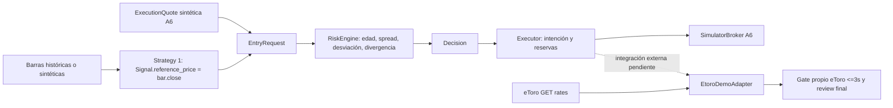

# Massive operativo: investigación read-only, 2026-09-16

**Estado corregido: CREDENTIAL_SOURCE_UNVERIFIED. A7 = PARTIAL/BLOCKED.**

Actualización autorizada: el diagnóstico ahora lee exclusivamente MASSIVE_API_KEY
del .env en la raíz del repositorio, resuelta desde la ubicación del script.
No usa la variable heredada de Windows como fallback ni expande otras variables.
Admite un valor literal, opcionalmente entre comillas; duplicados, ausencia o
formato inválido bloquean antes de red. .env permanece sin modificar. Comprobación
actual: MASSIVE_API_KEY [.env] MISSING. 21 pruebas del diagnóstico PASS; Ruff PASS.
Este cambio aislado no valida la credencial histórica ni modifica código de trading.

### Rectificación de procedencia de credencial

La conclusión anterior sobre acceso operativo queda invalidada: los tres HTTP 403
se conservan como observaciones, pero no demuestran una prueba con credencial
Massive válida. No permiten decidir disponibilidad del producto ni plan del usuario.

El probe del intento original obtenía `secret = os.getenv("MASSIVE_API_KEY", "")`; PRESENT significa
solamente cadena no vacía. Usa ese mismo valor para construir Authorization Bearer.
Solo comprueba ausencia/espacios, no emisor, propietario, vigencia ni entitlement.
Además, el resultado CONTRACT_CHANGE_NOT_JUSTIFIED estaba escrito como constante
del diagnóstico: no constituye una verificación de identidad de la credencial.

Auditoría local posterior, sin llamadas al proveedor ni impresión de valores:

| Fuente/comprobación para MASSIVE_API_KEY | Presencia |
|---|---|
| Entorno del proceso | PRESENT |
| Entorno persistente User de Windows | PRESENT |
| Entorno persistente Machine de Windows | MISSING |
| Asignación en .env del repositorio | MISSING |
| Proceso uv --no-env-file | PRESENT |
| Proceso uv --env-file .env | PRESENT |
| Referencia en perfiles PowerShell existentes revisados | MISSING |

UV_ENV_FILE, UV_NO_ENV_FILE y UV_CONFIG_FILE: MISSING. El cwd es la raíz
C:\Users\epulgare\Nueva carpeta\Bot 3; --env-file .env apunta allí.
uv.ps1 no cambia cwd ni carga MASSIVE_API_KEY: solo configura caché/Python/UTF8
y transmite argumentos a uv. El probe no carga dotenv, YAML, config del bot,
archivos de credenciales ni secretos del conector. La fuente inmediata es el
entorno heredado. Windows User es una fuente persistente candidata observada;
no se ha demostrado quién creó esa variable, ni que haya sido su único origen
en el proceso anterior. No se inspeccionaron historiales de comandos con secretos.

Las fuentes de carga posibles en esta invocación son entorno heredado (padre,
sesión y configuración User/Machine de Windows) y dotenv explícito de uv; sus
selectores son --env-file/UV_ENV_FILE y --no-env-file/UV_NO_ENV_FILE. No hay
loader adicional del probe. El cliente histórico Massive también lee únicamente
MASSIVE_API_KEY, pero ni su validación de formato ni capturas históricas identifican
la credencial exacta de este spike. verify.py borra esa variable de los procesos
de pruebas; los tests no suministran la credencial de la ejecución externa.

MassiveCredentials y el probe no tienen fingerprint de credencial. El fingerprint
eToro pertenece a sus dos claves y no es reutilizable como identidad Massive.
No se calculó ni imprimió un fingerprint nuevo. La evidencia de 16:40 UTC guarda
PRESENT sin identidad de credencial; por ello no se puede demostrar qué valor
exacto se envió entonces ni afirmar que autenticó con éxito. Se conoce el mecanismo
de envío, no su autenticidad. No hubo peticiones nuevas ni cambios en .env,
variables persistentes, código productivo, A7 o contratos.

Rectificación sanitizada: runtime/massive-operational/credential-source-audit.json.
Las secciones siguientes conservan el análisis y los hechos del intento anterior;
cualquier inferencia de disponibilidad por esos 403 queda subordinada a esta nota.

Este documento es investigación, no un ADR aprobado ni modificación contractual.
NO PRODUCTION CODE CHANGES. No se modifica A7 ni se habilitan órdenes.
Etiquetas: **observado** = ejecución externa capturada; **actual** = repositorio;
**documentado** = contrato público consultado; **inferencia/propuesta** = no implementado.

## 1. Current Contract

**Actual/histórico.** `git log -S QUOTE_STALE_OR_DELAYED` y `git blame` atribuyen
el gate al baseline `6af05f1b16b8e3488a5cd959dc0e7f889b258fd6`, 2026-09-10,
anterior a A1–A7. BOOTSTRAP_SPEC.md:153 reserva a eToro los precios ejecutables;
RISK_POLICY.md:22 exige cotización <=3s. El baseline del adapter ya consultaba
EtoroMarketDataProvider y rechazaba edad >3s. Es política local; no SLA del proveedor.

| Responsabilidad | Comportamiento realmente implementado |
|---|---|
| eToro bid/ask/fecha | brokers/market_data.py lee rates v2, valida identidad, Decimal, bid<=ask, timestamp y quoteType; recepción HTTP UTC |
| eToro frescura | brokers/etoro_demo.py exige realtime, no futuro, edad <=3s antes de revisión final |
| Spread y riesgo | risk/engine.py evalúa los bid/ask de EntryRequest y las referencias suministradas; no conoce proveedor |
| Identidad/cuenta/permisos | GuardedTransport.observe_demo y verify_mutation_identity; cuenta/scopes/credenciales/sesión/autorización vinculadas |
| Restricciones/costes | EtoroDemoAdapter verifica eligibility, leverage 1, mínimos/máximos, stop; normaliza costes observados/documentados |
| Ejecución | Adapter tiene contratos mock; barrera externa permanece activa; no hay vertical externo validado |
| Reconciliación | UUID/identificadores, propiedad, UNKNOWN, reservas; cierre externo no certificado contablemente |
| Massive | massive_http.py descarga solo agregados de fechas NY anteriores a hoy; massive.py carga captura offline |
| OHLCV/RVOL | A2 valida AAPL/SPY/QQQ históricos, volumen/ajustes/calendario; no mide recepción live |
| Señales/replay | Strategy 1 usa barras; A4 permite reloj lógico replay_as_of_v1 sin reclasificarlo como captura operativa |
| A6 | SessionInputs/ExecutionQuote sintéticos, RiskEngine y SimulatorBroker; no Massive operativo ni ejecución eToro |

Archivos leídos: AGENTS/STATUS/HANDOFF/TASKS, BOOTSTRAP_SPEC, system_context,
ARCHITECTURE, decisions, RISK_POLICY, MASSIVE_DATA_CONTRACT, STRATEGY_1_A3_AUDIT,
REPLAY_AS_OF_V1, A6_SESSION, A7_DEMO_ONLY/A7_COMPLETION_ATTEMPT/A7_QUOTE_COST_AUDIT,
ADR 002-data-broker y 006-arming; Massive, market_data, etoro_demo, RiskEngine,
EntryRequest, session_inputs, service y consumidores backtesting.

### Dependencias temporales y de precio



RiskConfig.max_quote_age_seconds=3; YAML A3 lo congela y AppConfig impide
alterarlo en v1. RiskEngine._reject_reason evalúa `(now-quote_at).total_seconds()`;
rechaza futuro/naive. No contiene proveedor ni recepción que certifique procedencia.

Construcción exacta:

- execution/session_inputs.py::ExecutionQuote.entry: quote_at=observed_at,
  now=decision_at, entry_price=ask, reference_price=signal.reference_price,
  source_price=self.source_price. A6 son entradas explícitamente sintéticas.
- service.py: cotización fabricada para demo offline, source_price=reference de señal.
- backtesting/engine.py: quote_at=signal.available_at, proxy y tiempo modelados;
  no representa evidencia del precio ejecutable live.
- strategies/orb.py: reference_price=bar.close de la candidata.
- Adapter eToro: gate de BrokerQuote.event_time separado del anterior; review
  callback debe revalidar riesgo. No existe una conexión Massive live implícita.

Cambiar solo quote_at a una fecha Massive conservando bid/ask eToro antiguos
desvincularía el tiempo del precio evaluado. Esa sustitución no es una corrección
de timestamp y queda prohibida en esta investigación.

Tests directamente relacionados: test_risk_engine (STALE_QUOTE, FUTURE_DATA,
spread, PRICE_DEVIATION, SOURCE_DIVERGENCE); test_demo_quote_cost_audit (0/3/3.001s,
UTC/recepción/HTTP nuevo); test_etoro_adapter y test_demo_pre_send (validación y
cero mutación); test_demo_session (stale/spread/price/recovery).
Dependencias indirectas: test_demo_only_identity, test_etoro_transport,
test_execution_engine, test_persistence_recovery, test_close_reconciliation,
test_strategy_v1, test_strategy_a3_audit, test_strategy_orb, test_replay_as_of,
test_backtest_replay, test_massive_history, test_massive_a2, test_data_contracts,
test_import_phase2, test_market_audit, test_phase2_broker, test_config_api,
test_e2e_http y test_demo_preflight. Suite completa requerida; ningún test previo cambiado.

## 2. Massive Operational Evidence

**Observado.** Credential MASSIVE_API_KEY: PRESENT. Plan: UNKNOWN.
Tres GET HTTPS Last NBBO con la credencial existente, TLS/CA/proxy actuales,
sin redirects, URL arbitraria, query con secretos, cookies persistidas o retries.
Los cuerpos de error no se guardan. No se contactó eToro durante el spike.

| Símbolo | Ruta | HTTP | received_at UTC | decision_at UTC | Quotes válidas |
|---|---|---|---|---|---|
| AAPL | /v2/last/nbbo/AAPL | 403 | 16:40:14.507028500Z | 16:40:14.508031700Z | 0 |
| SPY | /v2/last/nbbo/SPY | 403 | 16:40:27.869702900Z | 16:40:27.869702900Z | 0 |
| QQQ | /v2/last/nbbo/QQQ | 403 | 16:40:41.242167200Z | 16:40:41.242167200Z | 0 |

Fecha común: 2026-09-16, sesión regular estadounidense. Ventana prevista 300s;
terminación anticipada tras 41.125s por ACCESS_OR_DATA_FAILURE. Descubrimiento
espaciado 13s para no asumir cuota pagada; una eventual ventana accesible usaría
1 GET/s total, turnándose entre símbolos. Es muestreo, no cobertura continua ni
benchmark. No se ejecutó esa segunda fase porque los tres símbolos fueron denegados.

Para **cada** símbolo: bid/ask, SIP/participant timestamp, edades, porcentaje <=3s,
mediana, p95 y máximo son **N/A / null**, nunca cero ni valores inventados.
Errores: 1 por símbolo; rate limits observados: 0; fallos de transporte: 0.
Repeticiones, gaps y eventos fuera de orden: no caracterizables con cero eventos;
los contadores cero del JSON solo significan que no se procesó ninguno.
El 403 demuestra acceso denegado en esta ruta/credencial/momento; no identifica
por sí solo plan, causa exacta ni indisponibilidad general de todos los productos.
No se reintentó una denegación para llenar artificialmente la ventana.

Evidencia privada local:
`runtime/massive-operational/live-20260916/observations.jsonl` y `summary.json`.
Código explícito, fuera del paquete productivo: scripts/probe_massive_operational.py.

```powershell
.\scripts\uv.ps1 run --frozen --env-file .env python scripts/probe_massive_operational.py --output runtime/massive-operational/live-20260916
```

Python exit 2 por interrupción de la ventana; launcher PowerShell exit 1.
Carpeta exclusiva: una nueva ejecución necesita otro destino, nunca sobrescribir.

### Capacidad documentada frente a acceso observado

| Producto | Contrato público | Estado en este proyecto |
|---|---|---|
| REST Last Quote | NBBO más reciente, bid/ask, tamaños, SIP y participante; acceso según entitlement | Tres 403; no disponible en esta prueba |
| REST Quotes | NBBO por rango, SIP/participante, secuencia y paginación | Documentado; no usado como fallback tras 403 |
| WebSocket Quotes | NBBO por eventos, feed realtime separado del delayed | Sin implementación ni conexión; entitlement no verificado |
| Minute aggregates | OHLCV por trades elegibles, actualizaciones, inicio/final del intervalo | Histórico verificado; modalidad operativa no probada |

Fuentes oficiales consultadas 2026-09-16:
[Last Quote](https://massive.com/docs/rest/stocks/trades-quotes/last-quote),
[Quotes REST](https://massive.com/docs/rest/stocks/trades-quotes/quotes),
[Quotes WS](https://massive.com/docs/websocket/stocks/quotes),
[minute aggregates](https://massive.com/docs/websocket/stocks/aggregates-per-minute).
Una etiqueta realtime del catálogo no acredita acceso del usuario ni SLA <=3s.

### Semántica temporal propuesta, no adoptada

REST Last Quote `t` es SIP Unix ns, `y` generación participante/exchange Unix ns;
REST Quotes usa sip_timestamp/participant_timestamp. WS Quotes `t` es SIP Unix ms.
La unidad debe venir del contrato, no adivinarse por longitud. El spike conserva
enteros, normalización UTC con nueve decimales y ambas edades independientes.
La resolución representada del reloj local no demuestra precisión nanosegundo.

SIP expresa observación consolidada; participante aproxima origen del evento.
Usar SIP como event_time limita edad desde consolidación, no desde exchange.
La opción más conservadora para estudiar origen es participante con SIP separado;
requiere validar semántica NBBO y orden temporal. No se elige una fuente normativa
ni se interpreta participante ausente como recibido ahora. Offset local: UNVERIFIED.

`age_at_receive = received_at - event_time`; `age_at_decision = decision_at - event_time`.
Solo una futura medición con reloj acotado puede acreditar <=3s; se reevalúa al decidir.
Future timestamp bloquea; no se recorta a cero. Duplicado no renueva event_time.
Mismo evento en respuestas sucesivas envejece. Evento anterior no sustituye al más
nuevo; se registra incidencia. Secuencias no contiguas no prueban paquetes perdidos
(el contrato las define crecientes, no consecutivas). No eventos >3s bloquea aunque
la conexión esté viva o la actividad sea baja. Desconexión/clock drift/restart
invalidan aptitud hasta reconstrucción verificable; no fallback a histórico.

## 3. Strategy 1 Compatibility

Necesita 20 warmups, barras de minuto AAPL y benchmarks SPY/QQQ, volumen elegible,
misma base de precios, apertura regular, ORH/ORL/RVOL, RS en el mismo intervalo,
recepción/disponibilidad causal, final=true y revision=0. SPY/QQQ no son operables.
Cutoff de selección apertura+5m+2s y TTL de señal 10s siguen intactos.

**Documentado:** aggregates operativos se actualizan/reenvían por trades tardíos;
el final de intervalo no equivale a publicación final inmutable.
[Explicación del proveedor](https://massive.com/blog/aggregate-bar-delays).
**No demostrado:** instante de primera barra utilizable, volumen fraccionario y
ajustes compatibles con warmups, revisión/correcciones, recepción de benchmarks
antes del cutoff. El campo de volumen WS requiere validar su semántica con el
producto concreto, no importar ciegamente el contrato histórico.

No declarar final a una barra por recibirla o por pasar su e; tampoco aplicar
replay_as_of_v1 al live. Una futura frontera podría conservar primera versión
causal y revisiones aparte, pero solo tras demostrar qué significa utilizable
para la estrategia congelada. Si requiere esperar/cambiar cutoffs, reabre A3.
NBBO por sí solo no suministra OHLCV ni RVOL. Compatibilidad operativa: NOT_PROVEN.

## 4. Price Semantics

MarketReferencePrice: referencia de mercado de un feed identificado, no oferta eToro.
ExecutionVenueSnapshot: bid/ask eToro con fecha propia, no garantía de fill futuro.
Execution price: precio confirmado de fill y cantidades, con costes reconciliados.
El contrato vigente llama ejecutable al precio del broker para evaluación previa,
sin afirmar ejecución garantizada. No llamar Massive "eToro executable price".

## 5. eToro Price Protection

**Documentado, no ejecutado.** Catálogo oficial v1.379.0 / skill 1.20.0 y esquemas
Demo v1/v2/v3 consultados mediante get-route-spec. Captura íntegra:
`runtime/massive-operational/etoro-price-contracts.json`.

| Mecanismo | Demo y restricciones | ¿Acota el fill? / impacto |
|---|---|---|
| mkt | v2/v3 apertura buy; instrumento/producto/tamaño/stop elegibles | Precio disponible; no campo de máximo slippage demostrado para mkt |
| v1 limit-orders / MIT | Umbral mejor que mercado: inferior para long; dispara Market Order | NO es techo del fill; espera trigger y altera momento de entrada |
| v2/v3 limitIOC | orderType=limitIOC, limitRate positivo, triggerRate prohibido; precio enviado no puede desviarse >10% del mercado según esquema | Documenta ejecución inmediata al límite o mejor, cancelación si no hay precio; aptitud por cuenta/instrumento y parciales no probados |
| SL/TP | Protección/trigger de posición | No limitan precio de entrada ni garantizan precio de cierre |

Fuentes: [v2 Demo](https://api-portal.etoro.com/api-reference/trading--demo/create-an-order),
[v3 Demo](https://api-portal.etoro.com/api-reference/trading--demo/submit-an-order-for-asynchronous-processing).
V3 exige settlementType para no-MIT y omitirlo para MIT; abrir no acredita contrato
de cierre (close aún no soportado allí). HTTP 200/202 no demuestra fill.
El límite proveedor 10% es rechazo de pre-trade, no nuestro límite de riesgo:
no reemplaza 0.5%/0.3% ni los 3s. limitIOC podría acotar nominalmente la compra aun
con snapshot viejo, pero no demuestra spread actual ni semántica del stop/costes.
Cambiar mkt a IOC altera fills, cancelaciones y resultados de replay: requiere
revisión explícita del contrato de ejecución y del impacto A3/A4/A6/A7.
No se propone ni implementa aquí; no hubo llamadas execute-write.

## 6. Divergence Model

Actual: entry_price=ask; reference_price=close de señal; source_price=referencia
adicional explícita; campos opcionales en EntryRequest. RiskEngine compara:
spread=(ask-bid)/ask <=0.003; abs(entry-reference)/reference <=0.005;
abs(entry-source)/source <=0.005. Ausente el precio opcional, no corre ese guard.

**Hipótesis futura, NO arquitectura aprobada:** MarketReferencePrice podría aportar
Massive NBBO/evento y source_price; ExecutionVenueSnapshot preservaría bid/ask eToro.
reference_price conservaría significado de señal, sin reutilizarlo para ocultar
una segunda referencia. Se necesitarían identidad, fuente y tiempos por precio.
No refrescar un precio eToro viejo asignándole quote_at Massive. Comparar valores
de instantes distintos confunde movimiento del mercado con diferencia entre fuentes.
Una comparación vieja puede rechazar; no acredita por sí sola ejecución segura.
IOC es una vía documental a estudiar, no reemplazo del spread/divergencia/frescura.
No hay pares simultáneos Massive/eToro ni fills para medir divergencia aquí.

## 7. Contract Impact

| Archivo/alcance | Reapertura necesaria si se autoriza una alternativa |
|---|---|
| BOOTSTRAP_SPEC.md, ADR 002-data-broker | Fuente ejecutable y autoridad de mercado: cambio normativo |
| ARCHITECTURE.md, decisions.md | Responsabilidades y aceptación formal: cambio normativo, no mera edición |
| RISK_POLICY.md / EntryRequest | Procedencia por precio/tiempo y mandatory guards: revisión de riesgo |
| MASSIVE_DATA_CONTRACT.md / A1 | Contrato operativo separado; histórico no se reclasifica |
| A3 freeze / STRATEGY_1_A3_AUDIT / snapshot JSON | Impacto en causalidad/finalidad/órdenes/riesgo; revisar antes de cambios |
| YAML y hashes A3 | No cambiar números ni regenerar hashes; cada SHA afectado requiere motivo y versión revisada |
| A4 / REPLAY_AS_OF_V1 | Mantener evidencia histórica; IOC o cambios de fills requieren modelo nuevo explícito |
| A5 | Evidencia read-only permanece histórica, no autoriza nuevo feed ni órdenes |
| A6_SESSION y frontera A6→A7 | Sustituir inputs simulados requiere contrato nuevo, sin promover mocks |
| ETORO_API_AUDIT / A7 / armado | Tipo de orden, disponibilidad efectiva, validaciones y reconciliación |
| Tests / VERIFICATION | Regresiones causales, fallos, límites y evidencia externa identificada |

Actualizar STATUS/HANDOFF con el resultado de investigación es seguimiento, no
reapertura. Este nuevo informe tampoco modifica contratos. A2/A4/A5 conservan
sus resultados dentro del alcance original. No cambiar Strategy 1 para aceptar
datos incompletos o forzar una señal.

## 8. Risks

| Riesgo | Impacto | Detección | Mitigación candidata | ¿Bloquea? |
|---|---|---|---|---|
| Acceso/plan Massive | No datos operativos | 403 observado; plan UNKNOWN | Aclarar entitlement sin comprar/cambiar plan automáticamente | Sí, actual |
| Timestamp/unidad inadecuados | Edad falsa | Esquema/ns/ms/UTC/pruebas | Contrato explícito y originales enteros | Sí hasta verificar live |
| Gaps >3s | Precio viejo | Edad al decidir; ventana de muestras | Fail closed, no renovar evento | Sí durante gap |
| Baja actividad | Ausencia de novedades | Evento repetido con conexión viva | Conservar gate; no inferir feed caído o vigente | Sí cuando >3s |
| Latencia SIP | Referencia atrasada | SIP/participante/recepción separadas | Medir ambas edades | Sí si incumple |
| Diferencia reloj exchange | Origen temporal dudoso | Orden/offset/calidad por venue | No elegir timestamp más favorable | Sí si ambiguo |
| Late trades | RVOL/OHLC cambian | Versiones recibidas con hora causal | Conservar primera vista y correcciones | Sí sin contrato |
| Revisiones de barras | Lookahead o señales distintas | Raw/versiones/cutoff | Definir primera utilizable bajo A3 | Sí, actual |
| Divergencia Massive/eToro | Riesgo/sizing incorrecto | Comparación temporal misma acción/moneda | Guard 0.5%, referencias obligatorias | Sí sin evidencia |
| Spread diferente | Coste subestimado | Bid/ask por fuente y timestamp | Mantener spread broker y de mercado separados | Sí sin evidencia |
| Halt | No ejecución/quote vieja | Estado mercado y ausencia eventos | Pausar entradas, gestionar exposición | Sí para nuevas entradas |
| Broker quote stale | Spread/precio actual desconocido | Edad propia eToro | Gate vigente; estudiar IOC sin asumir suficiencia | Sí, actual |
| Network partition | Feed incompleto | Timeout/desconexión | Invalidar aptitud, cero fallback | Sí |
| Clock drift | Falsa frescura/futuro | Offset sincronización y reloj monotónico | Acotar incertidumbre, bloquear si desconocida | Sí para certificar |
| Rate limits | Muestreo insuficiente | HTTP429/cuotas | Detener/respetar espera, no bursts | Sí si no hay datos vigentes |
| Restart | Estado/feed antiguo | Nueva sesión/boot y timestamps | Reconstruir; no reutilizar aptitud persistida | Sí hasta verificar |
| Fuentes discrepan | Decisión no confiable | Precios, identidad, tiempos | No escoger la que permita operar | Sí |
| limitIOC no elegible/parcial | Rechazo/exposición residual | Eligibility y lookup futuro | Contrato/contabilidad específica y tests | Sí sin validar |

## 9. Repository Changes

NO PRODUCTION CODE CHANGES. Añadidos solo script diagnóstico aislado, sus tests
y este informe. STATUS/HANDOFF pueden registrar resultado, sin cambiar reglas.
Raw sanitizado y snapshots bajo runtime ignorado; credenciales existentes no
impresas ni modificadas. No imports del bot en el spike, no runner, no RiskEngine,
no eToro, no WebSocket, no compras, no cambios globales, cero mutaciones.
Baseline por archivo de src/configs/docs/BOOTSTRAP_SPEC/uv.lock guardado antes
de trabajar en runtime/massive-operational/baseline.json para revisión de integridad.

## 10. Tests / Verification

12 tests del spike PASS: unidades ns/ms, UTC, timestamps futuros, duplicados,
fuera de orden, edades, participante ausente, serialización y redacción.
268 tests focales PASS, 5 warnings (Massive histórico, riesgo, A6 y A7).
No modificación de tests preexistentes. Los mocks solo prueban el diagnóstico.

```powershell
.\scripts\uv.ps1 run --frozen pytest tests/test_massive_operational_probe.py -q
.\scripts\uv.ps1 run --frozen pytest tests/test_massive_operational_probe.py tests/test_massive_history.py tests/test_risk_engine.py tests/test_demo_session.py tests/test_demo_only_identity.py tests/test_demo_pre_send.py tests/test_demo_quote_cost_audit.py -q
.\scripts\uv.ps1 run --frozen python scripts/verify.py
.\scripts\uv.ps1 run --frozen python scripts/scan_secrets.py
git diff --check
```

Collector final exit 0: **16/16 gates PASS**, **873 tests PASS**, 7 warnings,
cero fallos/errores/skips (pytest 168.98s). Ruff check/format, mypy, cobertura,
build y CLI PASS. Code unchanged during checks=true. Copia exacta en
runtime/massive-operational/verification.json. Secret scan: 190 archivos, cero
hallazgos. git diff --check exit 0. Inspector Strategy 1 PASS, hash
e751eb0db5be3f07950d5da5ccda0def4aeee6c03b0da83912ac38ed6beed7cb intacto.
Los 124 archivos previos de la baseline mantienen sus hashes; ninguna edición
productiva/normativa. No confundir gates locales PASS con acceso live o autorización.

## 11. Decision / criterios de investigación

Completados: reconstrucción contractual, origen <=3s, separación histórico/live,
tres símbolos consultados, timestamps documentados y parser probado, política
de fallos, análisis Strategy 1/revisiones, divergencia/protección eToro, impacto
y registro de riesgos. Cero mutaciones y REAL fuera de capacidad.

**No satisfechos por bloqueo externo:** ventana de precios reales, caracterización
estadística de frescura/gaps, timestamps live, acceso operativo positivo,
barras operativas compatibles y divergencia simultánea. No se marcan PASS.
Se concluye negativamente conforme al criterio B: no se requiere inventar una
ventana después de denegaciones para reconocer ausencia de evidencia fundamental.

Para reconsiderar harían falta acceso operativo verificado, ventana predefinida
con reloj acotado (no elegir una lectura favorable), semántica de barras compatible,
y protección de precios/spread/divergencia preservada. limitIOC documentado no
resuelve por sí solo estos requisitos y no autoriza cambiar mkt.

**CREDENTIAL_SOURCE_UNVERIFIED**
